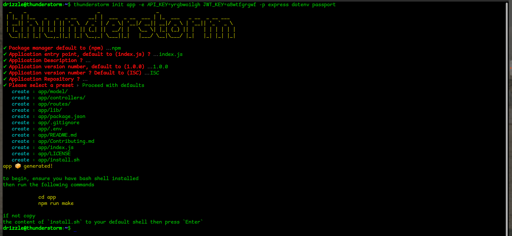

# ThunderStorm

A Command Line tool for quickly setting up server-application

## Features

- Simple
- Lightweight
- creates folders using best practice
- initialize project with packages
- ships with `package.json` and eliminates the need for `npm init`

## Installation

Thunderstorm is distributed with `npm` which ships with Node.js, to begin [install Node.js](https://nodejs.org), if you don't have it installed, then run `npm i -g @opeolluwa/thunderstorm`

## Usage/Examples

`thunderstorm` uses `bash` under the hood to execute package installation of application dependencies. Ensure to install `bash` shell before you execute `npm run make` or `yarn make`, depending on your preferred package manager. You could choose to copy the content on `install.sh` instead and execute it in your preferred Command Line Interface (terminal) when the project has been generated

- initialize a new basic project

```bash
$ thunderstorm init <application-name>

```

- initialize a project with packages

```bash
$ thunderstorm init <application-name> -p <package_01> <package_02> ...

```

- initialize a project with packages and environment variables

```bash

$ thunderstorm init <application-name> -p <package_01> <package_02> ...  -e <VARIABLE_01=value_01> <VARIABLE_02=value_02> ...

```

- See the initialization guide option

```bash
$ thunderstorm help init
```

- 

## Demo



## Run Locally

Clone the project

```bash
  git clone https://github.com/opeolluwa/thunderstorm
```

Go to the project directory

```bash
  cd thunderstorm
```

Install dependencies

```bash
  npm install
```

Start the server

```bash
  ./index.js
```

## Contributing

Contributions are always welcome!

See `contributing.md` for ways to get started.

Please adhere to this project's `code of conduct`.


